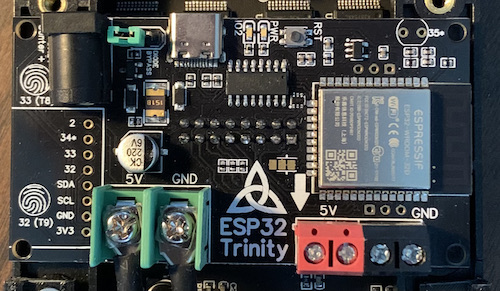

# tty2rgbmatrix
MiSTer fpga add-on showing text, pictures or animated gifs on an RGB matrix panel powered by an ESP32

 
this project is adapted from https://github.com/venice1200/MiSTer_tty2oled project to show mister core information on a separate display. i had an RGB matrix panel from another project lying around and figured i'd see what i could do. 

# hardware
what hardware you'll need:
- this project utilizes the ESP32-HUB75-MatrixPanel-I2S-DMA library which has some requirements for which MCU you can use. mrfaptastic's github for the library states: 
	- Espressif have kept the 'ESP32' name for all their chips for brand recognition, but their new variant MCU's are different to the ESP32 this [mrfaptastic's ESP32-HUB75-MatrixPanel-I2S-DMA] library was built for.
	- The library supports the original ESP32. That being the ESP-WROOM-32 module with ESP32‑D0WDQ6 chip from 2017. This MCU has 520kB of SRAM which is much more than all the recent 'reboots' of the ESP32 such as the S2, S3, C3 etc. <b><h1>If you want to use this library, use with an original ESP32 as it has the most SRAM for DMA</b></h1>.
	- Support also exists for the ESP32-S2.
	- ESP32-S3 is currently not supported (as of August 2022), but @mrfaptastic is working on this.
	- RISC-V ESP32's (like the C3) are not, and will never be supported as they do not have parallel DMA output required for this library.

- im using a Trinity EPS32 board made by Brian Lough -> https://esp32trinity.com/ which is designed specifically for this purpose with the hub75 connector on the board. you can wire an esp32 (or whatever microcontroller) directly to hub75 panels but you'll need to figure out the pinout etc and your milage may vary. the trinity board is just the easiest way to do it in my opinion

- a HUB75 compatible RGB matrix or matrices. im using (2) 64x32 rgb panels from aliexpress -> https://www.aliexpress.com/item/3256801502846969.html

- a big enough powersupply to run them both, usb power is NOT enough to run these panels. you MUST have an external powersupply

- optional: a sheet or piece of LED diffusing acrlyic. you can get these from TAP plastics or other places online

# software
what software you'll need:
- arduino IDE or equivalent. the animated gif library is arduino compatible only at this point. i investigated doing it circuit python but didn't get too far
- associated libraries:
	- ESP32 HUB75 library by mrfaptastic -> https://github.com/mrfaptastic/ESP32-HUB75-MatrixPanel-I2S-DMA
	- AnimatedGIF library by Larry Bank -> https://github.com/bitbank2/AnimatedGIF
- tty2oled code installed on your MiSTer. this is what sends the core info the MiSTer is running and the ESP32 reads
- something else i'm sure i'm forgetting

# setup

- setup arduino IDE (including adding ESP32 support if you are using an ESP32 based microcontroller) and the libraries mentioned above
- current version of the arduino sketch looks for image files on the microcontroller's built-in storage. this requires using SPIFFS and manually uploading the images via an ESP32 Sketch Data Upload Tool in the Arduino IDE:
	- https://github.com/me-no-dev/arduino-esp32fs-plugin
	- This tool will upload the contents of the data/ directory in the sketch folder onto the ESP32 itself
- flash your ESP32 with the tty2rgbmatrix.ino
- follow venice's instructions ( https://github.com/venice1200/MiSTer_tty2oled/wiki/Installation ) on setting up tty2oled on your MiSTer. tty2oled's scripts run on the MiSTer linux environment and tell your tty2rgbmatrix microcontroller what core is currently running. NOTE: do not use the built in microcontroller flash/setup system that tty2oled uses. that is not the correct code for tty2rgbmatrix.

# Work In Progress
items i'm still working on:
- ADD MORE GIFS OF ARCADE CORES
- add font library so that text that displays for cores that do not have images created are shown in a nicer way, perhaps scroll from right to left
- modify code to use an interrupt so that marquee changes happen faster. currently the code has to wait for the gif cycle to finish before it will recognize that the image should change and for longer gifs that is not ideal
- esp32 usually only comes with 4MB flash and a portion of that is used for code storage. current images are already filling up available space so i need to either 
	- a) add optional SDcard adapter to ESP32 board so microcontroller can access images/gifs externally rather than using storage on the microcontroller itself or 
	- b) pull images directly from MiSTer like tty2oled does

# Future Options (aka not any time soon)
- resize images/gifs that are not 128x32 'on the fly'
- add 4 more panels to make 192x64 a possibility

# Demo
https://youtu.be/un_bDXi2HBI