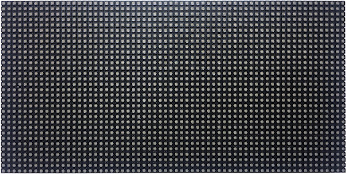
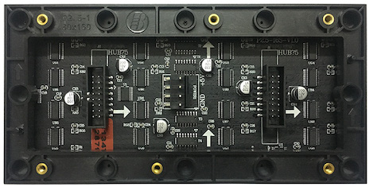
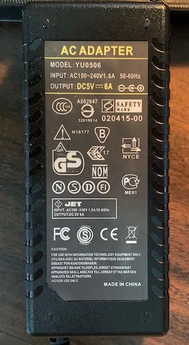

# tty2rgbmatrix
MiSTer fpga add-on showing text, pictures or animated gifs on an RGB matrix panel powered by an ESP32

 
this project is adapted from https://github.com/venice1200/MiSTer_tty2oled project to show mister core information on a separate display. i had an RGB matrix panel from another project lying around and figured i'd see what i could do. it has evolved from using the built in MCU flash storage to now using an external SDcard. 

# hardware
what hardware you'll need:
- this project utilizes the ESP32-HUB75-MatrixPanel-I2S-DMA library which has some requirements for which MCU you can use. mrfaptastic's github for the library states: 
	- Espressif have kept the 'ESP32' name for all their chips for brand recognition, but their new variant MCU's are different to the ESP32 this [mrfaptastic's ESP32-HUB75-MatrixPanel-I2S-DMA] library was built for.
	- The library supports the original ESP32. That being the ESP-WROOM-32 module with ESP32‑D0WDQ6 chip from 2017. This MCU has 520kB of SRAM which is much more than all the recent 'reboots' of the ESP32 such as the S2, S3, C3 etc. <b><h3>If you want to use this library, use with an original ESP32 as it has the most SRAM for DMA</b></h3>
	- Support also exists for the ESP32-S2.
	- ESP32-S3 is currently not supported (as of August 2022), but @mrfaptastic is working on this.
	- RISC-V ESP32's (like the C3) are not, and will never be supported as they do not have parallel DMA output required for this library.

- im using a Trinity EPS32 board made by Brian Lough -> https://esp32trinity.com/ which is designed specifically to interface with with the HUB75 rgb matrix panels. you can directly wire a compatible esp32 (see above warning on esp32 board that are compatible with the HUB75-MatrixPanel libaray) to HUB75 panels but you'll need to figure out the pinout, etc. and your milage may vary (YMMV). the trinity board is just the easiest way to do it in my opinion.

- a HUB75 compatible RGB matrix or matrices. im using (2) 64x32 rgb panels from aliexpress -> https://www.aliexpress.com/item/3256801502846969.html

- a big enough powersupply to run the MCU and RGB panels, usb power alone is NOT enough to run these panels. you MUST have an external powersupply

- an sdcard reader module (or at the very least a modified micro to standard sdcard adapter) and an sdcard (2 gig should be MORE than enough) for storing the image files. this attaches to the trinity board using the available pins near the barrel jack power input. see the sketch file for pinout details. 

- optional: an enclosure depending on where you want your tty2rgbmatrix to go. i have included some fusion 3d files and STL files for a desktop enclosure i have created (specificly sized for the panels, MCU and sdcard module I am using!) for your use if you wish. the desktop case also includes a gap for an optional sheet or piece of LED diffusing acrlyic. you can get these from TAP plastics or other places online. size the sheet to your needs.

# software
what software you'll need:
- arduino IDE or equivalent. the animated gif library is arduino compatible only at this point. i investigated doing it circuit python but didn't get too far.
- associated libraries:
	- ESP32 HUB75 MatrixPanel I2S DMA library by mrfaptastic -> https://github.com/mrfaptastic/ESP32-HUB75-MatrixPanel-I2S-DMA
	- AnimatedGIF library by Larry Bank -> https://github.com/bitbank2/AnimatedGIF
- venice, the creator of tty2oled that started this whole thing, has created a simplified version called tty2x that simplifies what it sends from the MiSTer (as far as the active core) to the MCU. this needs to be setup on your MiSTer -> https://github.com/venice1200/MiSTer_tty2x

# software setup

- (i'm working on a full installation guide from zero to hero but its taking some time, the basics are below)
- setup arduino IDE (including adding ESP32 support if you are using an ESP32 based microcontroller) and the libraries mentioned above
- the main version of tty2rgbmatrix has moved to using an sdcard, rather than the built in MCU spiffs, for storage as it ran out of space very quickly. the following instructions on uploading gifs directly to the MCU spiffs storage are no longer necessary if you are using an sdcard. 
  ~~current version of the arduino sketch looks for image files on the microcontroller's built-in storage. this requires using SPIFFS and manually uploading the images via an ESP32 Sketch Data Upload Tool in the Arduino IDE:~~
	- ~~https://github.com/me-no-dev/arduino-esp32fs-plugin~~
	- ~~This tool will upload the contents of the data/ directory in the sketch folder onto the ESP32 itself~~
- flash your ESP32 with the tty2rgbmatrix_sd.ino
- follow venice's instructions (https://github.com/venice1200/MiSTer_tty2x) on setting up tty2x on your MiSTer. these scripts run on the MiSTer linux environment and output via usb/serial to the tty2rgbmatrix MCU what core is currently running. 

# Work In Progress
items i'm still working on:
- ADD MORE GIFS OF ARCADE CORES - this is happening slowly, pulling from other sources as well. more to come...
- add font library so that text that displays for cores that do not have images created are shown in a nicer way, perhaps scroll from right to left
- ~~modify code to use an interrupt so that marquee changes happen faster. currently the code has to wait for the gif cycle to finish before it will recognize that the image should change and for longer gifs that is not ideal~~
- esp32 usually only comes with 4MB flash and a portion of that is used for code storage. current images are already filling up available space so i need to either
	- a) COMPLETED ~~add optional SDcard adapter to ESP32 board so microcontroller can access images/gifs externally rather than using storage on the microcontroller itself~~ or 
	- b) pull images directly from MiSTer like tty2oled does
- change how image files are chosen based on the core name read from the MiSTer. new sketch assumes a consistent directory structure and gif naming convention which allows for a simpler lookup routine to check for an animated gif for the core, a static version if no animated file was found, or to just display text if no image exists at all. the folder structure has been published on a separate github repo at https://github.com/h3llb3nt/marquee_gifs which is maintained by kconger, venice1200 and myself to help keep the projects consistent.

# Future Options (aka not any time soon)
- resize images/gifs that are not 128x32 'on the fly'
- add 4 more panels to make 192x64 a possibility

# Demo
https://youtu.be/un_bDXi2HBI

# Thank You!
- i want to thank all the members of the misterfpga.org forum who have helped and encouraged me to keep this project going; especially venice, reallarry, elluigi, moondandy, kconger, and everyone else on the forum 
- i also want to thanks brian lough for giving me the bug with his tetris clock for using rgb matrix panels and for designing the trinity esp32 board
- mrfaptastic for the matrix panel arduino library
- larry bank for the animated gif library
- adafruit for years of inspiration for various electronics projects
- sorg and all of the core developers on the MiSTer project
- Lu from LusRetroSource and Bob from RetroRGB for blowing this up on twitter and youtube
- and finally my wife, my daughter, and my friend theyellowdevil for (humoring me by) ooohing and ahhhing at all my flashy lights